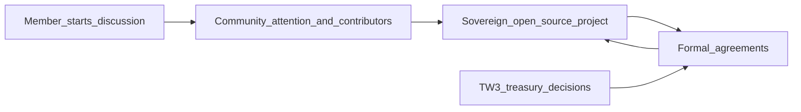

# TW3 philosophy

This document states *why* TW3 exists and how we think about public-good technology, community, and shared resources. Operational detail—governance mechanics, coding standards, org charts—will live in companion docs as they are written.

## Purpose of TW3

TW3 is a community of contributors who build **open-source, decentralized technologies** with **public good** in mind. We want people who share that intent to find a clear home for ideas, collaboration, and accountability—without pretending every detail of governance is finished on day one.

## What we mean by public good

We focus on **infrastructure**—sometimes protocols, sometimes platforms—where industries have shown **extractive** behavior: concentration of power, opaque rules, and outcomes that favor intermediaries over participants.

We aim for projects that are **sovereign** (independent, forkable, not captured by a single vendor) while remaining **collectively stewarded** in spirit: owned by their communities in practice, not merely in slogan. TW3 may **incubate** such efforts when that helps them survive and scale; incubation is a tool, not a requirement for every initiative.

The goal is **not** to maximize profit for a small group. It is to **level the playing field** so value flows according to relationships among participants and transparent rules—not only according to a gatekeeper’s self-interest.

**Example (illustrative, not a product commitment):** If streaming and publishing stacks systematically disadvantage musicians, a TW3-aligned effort might explore **artist-to-fan** models where compensation reflects what artists and audiences actually value, rather than what a publisher optimizes for alone. The point is the *principle*: infrastructure that aligns incentives with the people who create and consume the work.

## How ideas become projects

Any member of the organization can start a project as a **discussion**. There is no monopoly on who may propose work.

Momentum comes from the **community**: good ideas and serious execution tend to attract contributors and attention. We rely on something like a **court of public opinion**—not as a popularity contest alone, but as a practical signal of who is willing to build, review, maintain, and stand behind an effort.

**Rough consensus and working participation** matter more than formal ratification before anything exists. Success includes healthy **commons** (documentation, onboarding, respectful collaboration) and **adoption** where that is relevant—not revenue as the only measure.

## Treasury and agreements

Deploying **real value** (for example treasury funds) is a **community decision**. We expect that to happen through **deliberate choices**, not ad hoc spending.

Independent efforts remain **sovereign projects**. When TW3 invests, we anticipate **formal agreements** between the community and those projects—structures might include **profit-sharing** or other models that align incentives and make obligations clear. The aim is **transparency**, **mission alignment**, and **sustainable growth** of shared resources through wise agreements.

**Open questions** (to be spelled out in governance documentation): agreement templates, thresholds for treasury use, conflict resolution, and whether certain decisions belong on-chain, off-chain, or in a hybrid model.

## Open source as default

Work should be **open source** by default: inspectable, forkable, and improvable by others. That means any project *can* succeed on technical merit—but lasting success also depends on **social trust** and, where resources are shared, **economic alignment** through community process and agreements.

## How the pieces fit together

## What this document is not

- **Legal or financial advice**—structures for agreements and treasury use require appropriate review.
- **Token policy** or definitive **governance procedures**—those belong in dedicated governance materials when ready.
- **Coding practices** or **role definitions**—see this repo’s README for where those will be linked as they are added.

---

**Next steps for the repo:** governance mechanics, coding practices, and organization structure as separate, linked documents so contributors can go from *why* (this file) to *how* (the rest).
